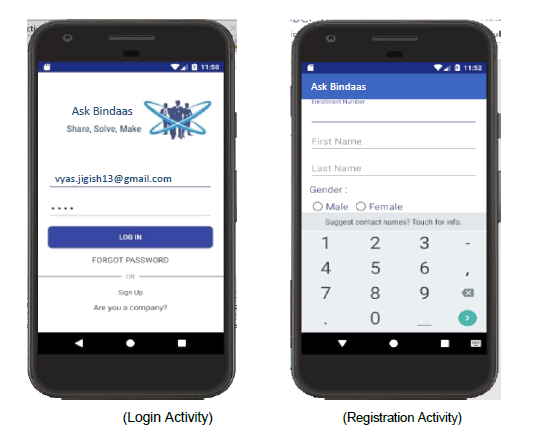
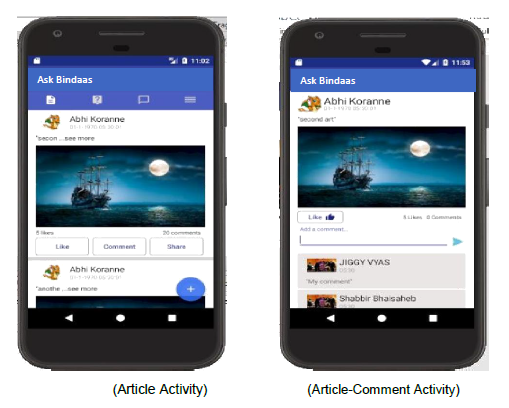
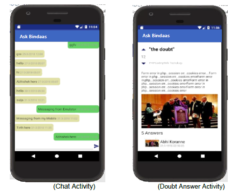

# Ask Bindaas - The Engineer's Book

**Ask Bindaas** brings all the students, faculties, alumni etc. together at one place so that they can interact with each other. Using this app students can get their doubts solved in real time by asking it publicly or they can chat one-to-one with peers, faculties and alumni to get it clear. Also the companies can register themselves and get the complete analytics of previous year placement details of any college.

## Some Snaps of the App are:

## Development Tools & Technologies:

* Front End: Android 

* Back End: Java

* Database: SQLite Browser, Firebase Realtime NoSQL Database - to develop chat functionality

* Tools: Android Studio, Spring Boot, IntelliJ
